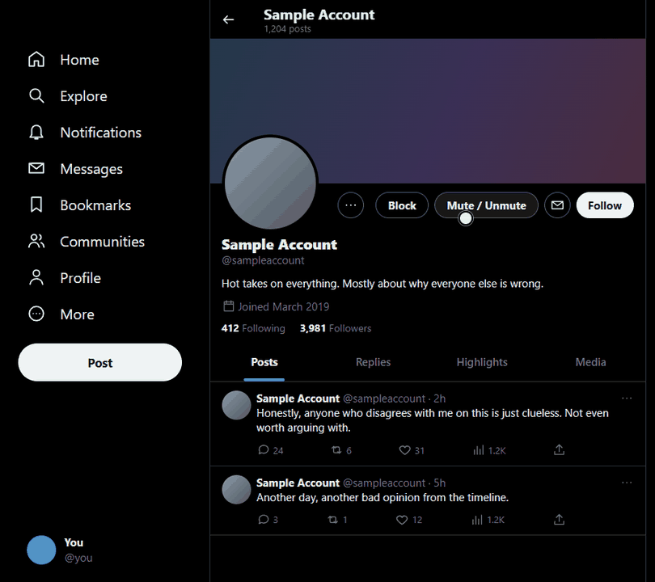
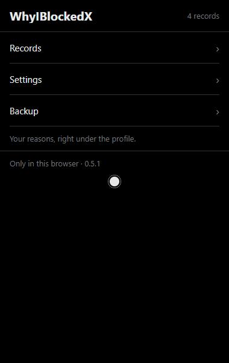

<p align="center">
  
</p>

<h1 align="center">WhyIBlockedX</h1>

<p align="center">
  <strong>Remember why you blocked or muted someone on X.</strong><br>
  Saves your reason and the related post, and shows them on the profile next time you visit.
</p>

<p align="center">
  
  
  
  
  <a href="https://github.com/isolmaz/WhyIBlockedX/actions/workflows/ci.yml"></a>
  <a href="LICENSE"></a>
</p>

---

## How it works

### 1. Block in one click, write the reason in place

Use **Engelle** (Block) next to the profile's menu. X's confirmation is handled for you, and a panel opens under the profile. Write your reason and press **Ctrl+Enter**.

<p align="center"></p>

### 2. Block from a post — the post is saved too

Block or mute from a post's **⋯** menu and the post's text and link are kept as context.

<p align="center"></p>

### 3. Everything in one popup

Search and filter your records, edit reasons, change settings and back up your data.

<p align="center"></p>

> The recordings use a simulated X page with the real extension loaded.

## Features

- **Reasons on profiles** — your note and the related post appear under the profile and in hover cards.
- **One-click actions** — block, mute and undo from profiles, hover cards, post menus and account lists.
- **History kept** — unblocking marks a record as ended instead of deleting it; reuse an earlier reason in one click.
- **Drafts** — unfinished notes survive reloads and browser restarts.
- **Native look** — follows X's theme, accent colour and font.
- **Backup** — export and import JSON.

## Privacy

Everything stays in your browser's local storage. No servers, accounts, sync or analytics; the only permission is `storage`. See the [privacy policy](PRIVACY.md).

> [!WARNING]
> Removing the extension deletes your records. Download a backup first: **Backup → Download backup**.

## Install

**Chrome Web Store:** [WhyIBlockedX](https://chromewebstore.google.com/detail/enmdpnmbnmmlnfchlbolggldjnmbappb), then reload open X tabs. Store installs update automatically.

**From source:**

1. `git clone https://github.com/isolmaz/WhyIBlockedX.git`
2. Open `chrome://extensions` (or `edge://extensions`) and turn on **Developer mode**.
3. **Load unpacked** → select the cloned folder, then reload open X tabs.

To update, run `git pull` and click **Reload** on the extensions page; your records are kept.

The store and source installs keep separate records. To move from one to the other, use **Backup → Download backup** in the old one and **Restore from backup** in the new one.

## Notes

- Interface in English and Turkish. It follows the browser language; change it in **Settings → Appearance → Language**. Works with X in either language.
- Desktop web only. If X changes its interface some detection may stop working; unrecognised confirmations are never auto-approved.
- Accounts are matched by username, so handle changes are not tracked.

## Project

```
manifest.json     Extension manifest (root)
src/background.js Service worker; serialises storage writes
src/shared.js     Defaults, themes, URL validation
src/i18n.js       English and Turkish interface strings
_locales/         Store description (en, tr)
src/content/      Scripts injected into X
src/popup/        Records, settings and backup UI
docs/             User guide and release process (Turkish), README media
```

No build step, no dependencies. [Changelog](CHANGELOG.md) · [Guide](docs/KURULUM.md)

## Checks

CI ([`.github/workflows/ci.yml`](.github/workflows/ci.yml)) runs on every pull request and, through [`release.yml`](.github/workflows/release.yml), on every push to `main`. It needs Node.js and runs two checks; run the same ones locally from the repository root:

```
find src -name '*.js' -print0 | xargs -0 -n1 node --check   # JS syntax
node .github/ci/check-manifest.js                      # manifest references and locale JSON
```

There are no unit or end-to-end tests in CI.

**Releases:** a version bump on `main` is sent to the Chrome Web Store only after it is approved in GitHub Actions. See [docs/YAYINLAMA.md](docs/YAYINLAMA.md) (Turkish).

## License

[MIT](LICENSE). Not affiliated with X Corp.
